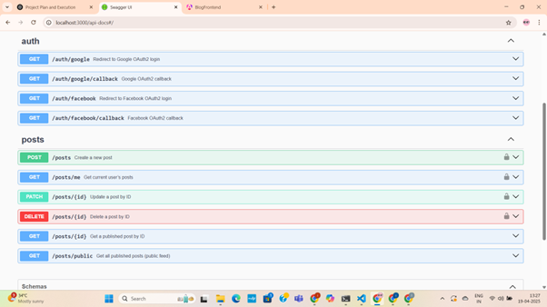

<p align="center">
  <a href="http://nestjs.com/" target="blank"></a>
</p>

📄 Environment Configuration
Before running the application or seeder scripts, make sure to set up a .env file at the root of your project.

🔐 Required Environment Variables
env
Copy
Edit
MONGO_URI=your_mongodb_connection_uri
JWT_SECRET=your_jwt_secret_key

GOOGLE_CLIENT_ID=your_google_oauth_client_id
GOOGLE_CLIENT_SECRET=your_google_oauth_client_secret

FACEBOOK_CLIENT_ID=your_facebook_oauth_client_id
FACEBOOK_CLIENT_SECRET=your_facebook_oauth_client_secret
💡 Note: Never commit your actual .env file to version control. Instead, create a .env.example file with placeholder values as shown above.

📝 Instructions
Create a .env file in the root directory of your project.

Copy the above keys into the file.

Replace the placeholder values with your actual credentials.


## Description

[Nest](https://github.com/nestjs/nest) framework TypeScript starter repository.

## Project setup

```bash
$ npm install
```

## Compile and run the project

```bash
# development
$ npm run start

# watch mode
$ npm run start:dev

# production mode
$ npm run start:prod
```

## Run tests

```bash
# unit tests
$ npm run test

# e2e tests
$ npm run test:e2e

# test coverage
$ npm run test:cov
```

## Deployment

When you're ready to deploy your NestJS application to production, there are some key steps you can take to ensure it runs as efficiently as possible. Check out the [deployment documentation](https://docs.nestjs.com/deployment) for more information.

If you are looking for a cloud-based platform to deploy your NestJS application, check out [Mau](https://mau.nestjs.com), our official platform for deploying NestJS applications on AWS. Mau makes deployment straightforward and fast, requiring just a few simple steps:

```bash
$ npm install -g @nestjs/mau
$ mau deploy
```

With Mau, you can deploy your application in just a few clicks, allowing you to focus on building features rather than managing infrastructure.

Once the NestJS server is running, you can access the automatically generated Swagger UI for exploring the API:

🔗 Swagger Endpoint:
http://localhost:3000/api-docs

This interactive documentation includes all available API routes, request/response schemas, and try-it-out functionality.

🔍 Swagger Preview
You can include a screenshot of the Swagger UI for clarity.

markdown
Copy
Edit

📝 Note: Make sure the image file (e.g., swagger-preview.png) is placed in the assets/ folder inside your project directory.

✅ Steps to View Swagger UI:
Start the NestJS server:

bash
Copy
Edit
npm run start
Open your browser and go to:
http://localhost:3000/api-docs

Explore and test all available API endpoints directly from the interface.

✅ Unit Testing with Jest
We use Jest as the testing framework for our NestJS application. The Create Post feature module is covered by unit tests in both the service and controller layers to ensure reliability and correctness of logic.

📂 Test File Locations
Service Layer Test
Located at:
src/posts/services/posts.service.spec.ts
This file tests the core business logic for creating and retrieving posts.

Controller Layer Test
Located at:
src/posts/controllers/posts.controller.spec.ts
This file ensures the HTTP request handling and routing logic works correctly.

▶️ How to Run Tests
You can run the tests using the following commands:

bash
Copy
Edit
# Run all Jest tests in the project
npm run test

# Run only the posts.service.spec.ts file
npx jest src/posts/services/posts.service.spec.ts

# Run only the posts.controller.spec.ts file
npx jest src/posts/controllers/posts.controller.spec.ts
🧪 These are unit tests, meaning they mock any external dependencies like the database, and isolate the logic inside the module being tested.

## Resources

🌱 Seeder Script Setup & Execution
To test performance and pagination at scale, we implemented a custom seeder script that populates the database with 10,000 dummy blog posts. This helps simulate a production-like environment with a large dataset.

🛠️ Libraries Used
The script uses the following libraries:

faker – To generate realistic mock data for post titles, content, and authors.

mongoose – For database connection and operations.

dotenv – To load environment variables from the .env file (e.g., MongoDB URI).

Install dependencies if not already present:

bash
Copy
Edit
npm install faker mongoose dotenv
📁 Script Location
The seeder script is located at:

bash
Copy
Edit
/scripts/seed-posts.ts
🚀 How to Run the Seeder
Use the following command to execute the script using the TypeScript compiler and Node:

bash
Copy
Edit
npx tsc scripts/seed-posts.ts && node scripts/seed-posts.js
Or, if you're compiling the whole project:

bash
Copy
Edit
npm run build
node dist/scripts/seed-posts.js
✅ Ensure that your .env file is properly configured with a valid MONGODB_URI before running the script.

✅ Result
After execution, your MongoDB database will be populated with 10,000 published posts, ready to be fetched via the API and rendered in the frontend with full pagination support.

🐳 Docker Setup & Deployment
The project includes a ready-to-use Dockerfile to simplify containerization and deployment of the NestJS server.

📦 Step 1: Build the Docker Image
Make sure you are in the project root directory (where the Dockerfile is located), then run:

bash
Copy
Edit
docker build -t blog-app .
docker build: Command to build a Docker image.

-t nest-posts-api: Tags the image with a name (nest-posts-api in this case).

.: Refers to the current directory as the Docker build context.

🚀 Step 2: Run the Docker Container
Once the image is built, run the application container with:

bash
Copy
Edit
docker run -p 3000:3000 --env-file .env blog
-p 3000:3000: Maps port 3000 of the container to port 3000 on your local machine.

--env-file .env: Loads environment variables from your local .env file into the container.

nest-posts-api: Name of the Docker image to run.

⚠️ Make sure your .env file is configured with valid environment variables such as MONGO_URI, JWT_SECRET, etc.

✅ Verify the API is Running
Once the container is up and running, access the API documentation at:

bash
Copy
Edit
http://localhost:3000/api-docs
This Swagger UI lists all the available API endpoints.